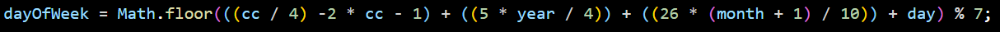

## Project Name
Akan Name generator

## Author
Omwono Hellen, A

## About this project
This is a web application that generates Akan names based on the user's date of birth and gender. Akan names are traditionally given to children born in Ghana based on the day of the week they were born.

## Setup and use instructions
These instructions will help you to install a copy of the project for development and testing.

- Clone the repository to your local machine: https://github.com/omwano/week_twoip.git
- Open the cloned folder in VS Code

To use the application, open the web application in your web browser and follow the below instructions.
- Go to live link https://omwano.github.io/week_twoip
- Enter your date of birth in the Date of Birth input field
- Select your gender from the dropdown menu.
- Click on "Generate Name" button.
- Your Akan name will be displayed at the bottom right on your screen.

## Technologies used
- HTML
- CSS
- JavaScript
- VS Code
- Github

## How it works
The application uses the following formula to calculate the day of the week a person was born:

where 
- cc is the century digits of the year of birth.
- year is the year digits of the year birth
 Based on the day of the week a person was born, the Akan name generator selects the corresponding name from an array of names for males or females.

## License
(c) 2023 Omwono Hellen
